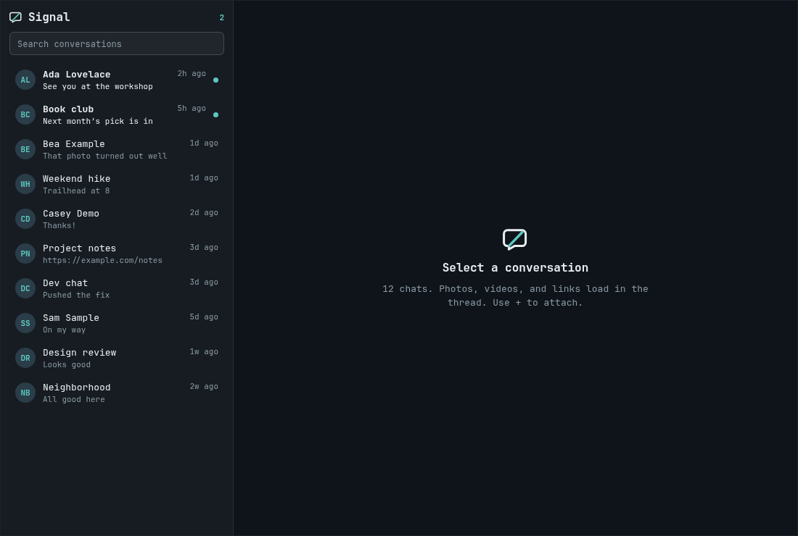

# Signal for Omarchy

A Signal client for the [Omarchy](https://omarchy.org/) bar. The window lists conversations already on this computer, shows photos and videos in the thread, and sends replies after you link Omarchy as a Signal device.



Plugins run unsandboxed inside `omarchy-shell`. Read this repository before enabling it.

## Requirements

- Omarchy Quattro
- [Signal Desktop](https://signal.org/download/) signed in on this computer (history is read from its local database)
- `/usr/bin/python3` (the engine creates `~/.local/state/omarchy/signal/venv` on first start and installs pinned `sqlcipher3-binary==0.6.0` and `cryptography==50.0.1`)
- `/usr/bin/qrencode` and `zenity` for the device-link QR code and file picker
- A one-time download of [signal-cli](https://github.com/AsamK/signal-cli) **v0.14.7** Linux-native (~110 MB). The archive and extracted binary are checked against pinned SHA-256 digests before use.

The plugin never writes Signal Desktop's database and never prints its key. It runs as the current user. Sending uses a linked extra signal-cli device, not as a replacement for Signal Desktop.

By default the plugin **starts Signal Desktop hidden** (`--start-in-tray`) so you can use this window as the messenger. New messages still need Desktop's process; you do not need its window on a workspace. Toggle **BG on / BG off** in the sidebar, or right-click the bar icon to open the official app.

## Install

```sh
omarchy plugin add https://github.com/Krustington/omarchy-signal.git --enable
```

Then place the widget if it is not already on the bar:

```sh
omarchy bar move krusty.signal --section right
```

## Use

| Input | Action |
| --- | --- |
| Left click the bar icon | Open or close the Signal window |
| Right click | Open official Signal Desktop |
| Middle click | Refresh |
| Enter in the composer | Send (Shift+Enter for a new line) |
| `+` | Attach a photo or file |

First send: click **Link device**, scan the QR from Signal on your phone (Settings → Linked devices). History still comes from Signal Desktop on this computer; the link is only for sending.

## Update

```sh
omarchy plugin update krusty.signal
```

## Remove

```sh
omarchy plugin remove krusty.signal
rm -rf ~/.local/state/omarchy/signal
```

That removes the plugin, its venv, downloaded signal-cli, and decrypted media cache. Signal Desktop and your messages stay put. Unlink **Omarchy** from your phone if you added it.

## License

MIT. See [LICENSE](LICENSE).

External dependencies: Signal Desktop (your existing install), [signal-cli](https://github.com/AsamK/signal-cli) (LGPL-3.0, downloaded on first link), Python packages `sqlcipher3-binary` and `cryptography` in a plugin-owned venv.

## Trademark

Signal is a trademark of Signal Messenger, LLC. This project is not affiliated with, endorsed by, or sponsored by Signal.
